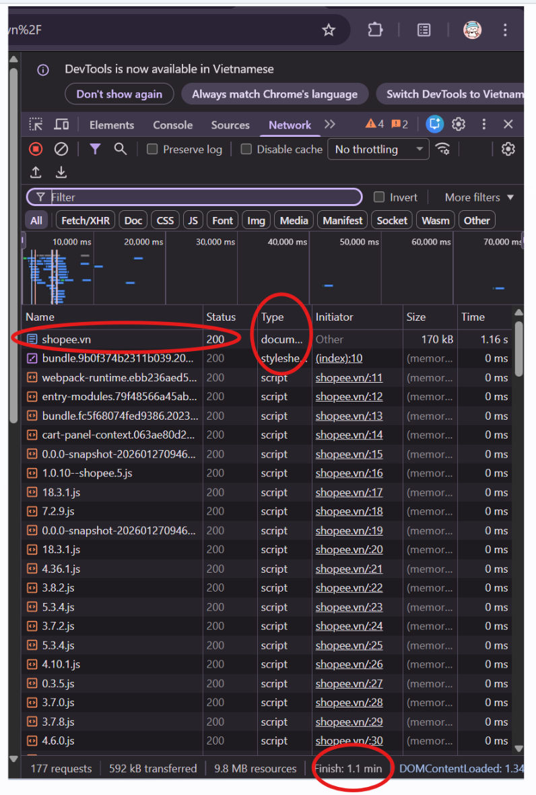
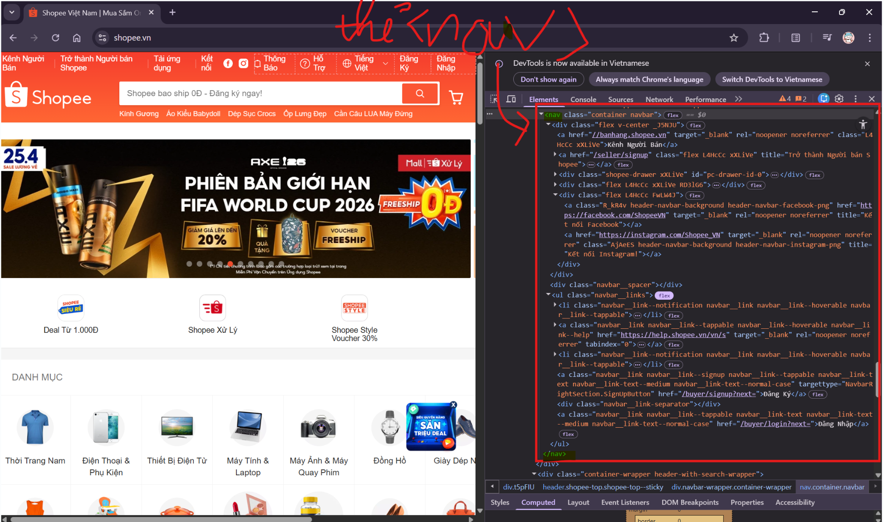
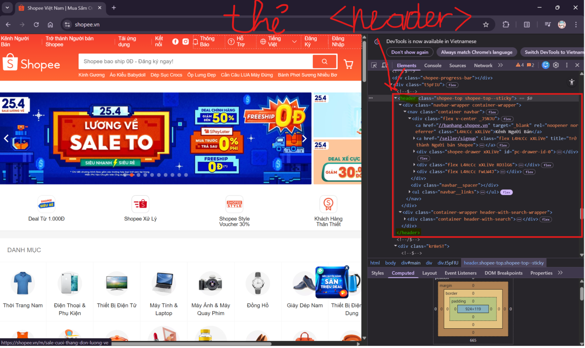
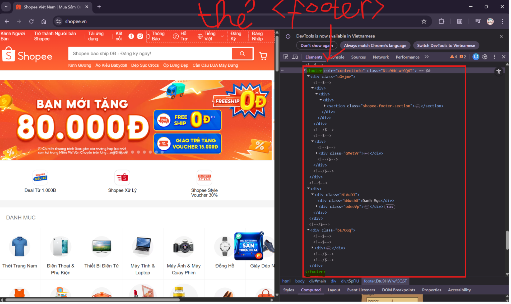
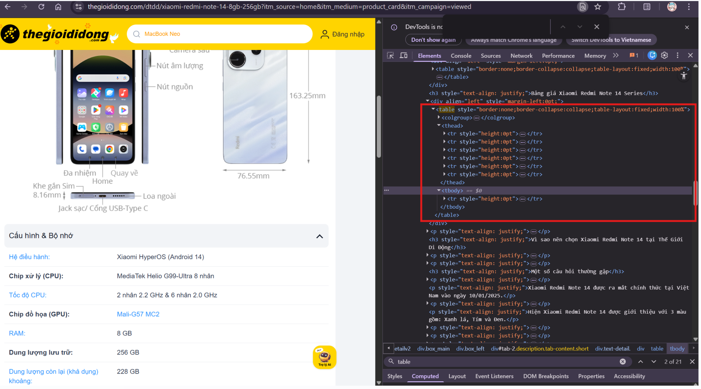

# 📋 PHIẾU BÀI TẬP 01

# **HTML5 FUNDAMENTALS — Cấu trúc, Semantic, Tables & Links**

> **Tài liệu tham chiếu:** `tuan_1_html5/01_introduction_html_universe.md` → `05_tables_hyperlinks.md`

## PHẦN A — KIỂM TRA ĐỌC HIỂU (20 điểm)

### Câu A1 (5đ) — HTTP & Browser

> **Nguồn tham chiếu:** `tuan_1_html5/01_introduction_html_universe.md`
> Đọc chương 01 (`01_introduction_html_universe.md`)

1.Các bước xảy ra khi gõ https://shopee.vn vào trình duyệt và nhấn Enter:\
-Gửi Request: Request xuất phát từ máy tính/laptop của bạn và đi qua router WiFi.\
-Truyền tải qua mạng: Yêu cầu đi qua nhà cung cấp dịch vụ mạng (ví dụ: VNPT) và chạy xuyên qua hệ thống cáp quang.\
-Đến Server: Request di chuyển đến Data Center (máy chủ) của hệ thống (trong trường hợp này là Shopee).\
-Xử lý tại Server: Máy chủ tiếp nhận yêu cầu, xử lý logic và dữ liệu.\
-Gửi Response: Server trả về response, dữ liệu này chạy ngược lại qua hệ thống mạng để về máy tính của bạn.\
-Render giao diện: Trình duyệt nhận các file HTML, CSS, JS từ server và tiến hành render (hiển thị) ra giao diện người dùng.

2.Trong DevTools của Chrome, tab Network cho thấy thông tin:\
-Danh sách request (yêu cầu)\
-Thời gian tải (performance)\
-Thông tin request & response\
-Kích thước dữ liệu\
-Thứ tự load


### Câu A2 (5đ) — Semantic HTML

> **Nguồn tham chiếu:** `tuan_1_html5/04_visible_part_html.md`

-Trang web bị Google đánh giá SEO thấp vì đang lạm dụng thẻ `<div>` cho mọi thành phần mà không sử dụng HTML Semantic.

-Các lỗi ngữ nghĩa:\
+Lỗi ở thẻ bao bọc sản phẩm: Sử dụng `<div` class="product"> là không chuẩn ngữ nghĩa. Đối với các trang E-commerce, cần dùng thẻ `<article>` cho sản phẩm để thể hiện đây là một nội dung độc lập, trọn vẹn.\
+Lỗi ở phần đầu trang (Header): Dùng `<div class="header">` không giúp trình duyệt hiểu đây là phần đầu trang. Cần thay bằng thẻ `<header>`.\
+Lỗi ở thanh điều hướng (Menu): Dùng `<div class="menu">` cho các liên kết điều hướng là sai mục đích. Cần dùng thẻ `<nav> `(navigation).\
+Lỗi ở vùng nội dung chính và chân trang: Việc dùng `<div class="main">` và `<div class="footer">` không có ý nghĩa ngữ nghĩa. Cần thay bằng thẻ `<main>` (chỉ định nội dung chính của trang) và thẻ `<footer>` (chỉ định phần chân trang).\
+Lỗi ở tiêu đề sản phẩm: Dùng `<div class="title">` thay vì các thẻ tiêu đề (heading). Tiêu đề sản phẩm nên được đặt trong các thẻ như `<h2>` hoặc `<h3>` để Google biết được cấu trúc thông tin.

Sửa lại:

```
<header class="header">
    <div class="logo">ShopTLU</div>
    <nav class="menu">
        <div><a href="/">Trang chủ</a></div>
        <div><a href="/products">Sản phẩm</a></div>
    </nav>
</header>
<main class="main">
    <article class="product">
        <h2 class="title">iPhone 16 Pro</h2>
        <div class="price">25.990.000đ</div>
        <div class="image"></div>
    </article>
</main>
<footer class="footer">© 2026 ShopTLU</footer>
```

### Câu A3 (5đ) — Block vs Inline

> **Nguồn tham chiếu:** `tuan_1_html5`

Hộp 1\
Text A Text B\
Hộp 2\
Text C Text D\
Hộp 3

### Câu A4 (5đ) — Table

> **Nguồn tham chiếu:** `tuan_1_html5/05_tables_hyperlinks.md`

-Sự khác nhau giữa `<thead>`, `<tbody>`, `<tfoot>`:\
+`<thead>` (Table Head): Nhóm phần đầu bảng, thường dùng để chứa các hàng tiêu đề của cột (các thẻ `<th>`).\
+`<tbody>` (Table Body): Nhóm phần thân bảng, nơi chứa toàn bộ nội dung dữ liệu chính của bảng (các hàng dữ liệu thông thường).\
+`<tfoot>` (Table Foot): Nhóm phần chân bảng, thường nằm ở cuối và được sử dụng để chứa các hàng tổng kết dữ liệu (Ví dụ: dòng "Tổng tiền" hoặc "Tổng số lượng" trong một hóa đơn).

-Không nên dùng table tạo layout trang web vì:\
+Lỗi thời và sai mục đích sử dụng\
+Mất đi tính Semantic và ảnh hưởng xấu tới SEO\
+Cứng nhắc, không thân thiện với di động(Resphonsive)\
+Code cồng kềnh, khó bảo trì

## PHẦN B — THỰC HÀNH CODE (60 điểm)

### Bài B3 (15đ) — Debug HTML

Lỗi 1: Dòng 1 — <!DOCTYPE> sai cú pháp — Sửa thành `<!DOCTYPE html>`\
Lỗi 2: Dòng 2 — Thiếu thuộc tính lang trong `<html>` — Thêm lang="vi"\
Lỗi 3: Dòng 4 — Thẻ `<title>` không đóng — Thêm `</title>`\
Lỗi 4: Dòng 5 — charset="utf8" sai chuẩn — Sửa thành UTF-8\
Lỗi 5: Dòng 9 — `<h1>` không đóng đúng — Sửa `</h1>`\
Lỗi 6: Dòng 13 — Thẻ `<a>` không đóng — Thêm `</a>`\
Lỗi 7: Dòng 20 — `<h3>` không hợp lý về cấp heading — Sửa thành `<h2>`\
Lỗi 8: Dòng 21 — img thiếu dấu "" và thiếu alt — Sửa thành src="..." và thêm alt\
Lỗi 9: Dòng 23 — Sai nesting thẻ `<b>` — Đưa `</b>`vào trong `<p>`\
Lỗi 10: Dòng 27 — `<h3>` nên là `<h2>` để đúng cấu trúc\
Lỗi 11: Dòng 29 — Thiếu `<thead>` và dùng sai `<td>` — Sửa thành `<thead>` + `<th>`\
Lỗi 12: Dòng 35 — Thiếu `<tbody>` — Thêm vào\
Lỗi 13: Dòng 40 — Dùng 2 thẻ `<main>` — Sửa cái thứ 2 thành `<aside>`\
Lỗi 14: Dòng 45 — `<p>` trong footer không đóng — Thêm `</p>`

### Bài B4 (15đ) — Phân tích trang web thật

1.Trang web: shopee.vn\
3 thẻ semantic HTML5:




2.Trang web thegioididong.com

-Table đó hiển thị nội dung: bảng giá và thông tin liên quan đến sản phẩm Xiaomi Redmi Note 14 Series trên trang Thế Giới Di Động.\
-Có dùng `<thead>`,`<tbody>`

3.Trang web thegioididong.com
\
-Form đó có: +action="/tim-kiem"\
+method: không khai báo

-Input types được dùng:
+type="text"\
+type="submit"

## PHẦN C — SUY LUẬN (20 điểm)

### Câu C1 (10đ) — Thiết kế cấu trúc

```
<!doctype html> <!--Khai báo HTML5-->
<html lang="vi"> <!--Ngôn ngữ tiếng Việt-->
  <head> <!--head: chứa metadata (không hiển thị)-->
    <meta charset="UTF-8" /> <!--Bộ mã ký tự-->
    <meta name="viewport" content="width=device-width, initial-scale=1.0" /> <!--Responsive-->
    <title>Chi tiết sản phẩm</title> <!--Tiêu đề trang-->
  </head>
  <body> <!--body: chứa toàn bộ nội dung hiển thị-->
    <header> <!--Phần đầu trang-->
        <nav> <!--Thanh điều hướng-->
            <ul> <!--Danh sách menu không cần thứ tự-->
                <li><a href="#">Trang chủ</a></li> <!--li: từng mục menu-->
                <li><a href="#">Danh mục</a></li>
                <li><a href="#">Liên hệ</a></li>
            </ul>
        </nav>
    </header>
    <nav aria-label="Breadcrumb"> <!--nav: Điều hướng phân cấp-->
        <ol> <!--ol: breadcrumb có thứ tự phân cấp-->
            <li><a href="#">Trang chủ</a></li> <!--li: từng cấp bậc-->
            <li><a href="#">Điện thoại</a></li>
            <li>Iphone 16</li> <!--li: cấp cuối, không cần link-->
        </ol>
    </nav>
    <main> <!--Nội dung chính của trang-->
        <section class="product-detail"> <!--Chi tiết sản phẩm-->
            <div class="product-images"> <!--div: nhóm ảnh-->
                <!--dùng div vì chỉ để layout-->
                 <!--img: hiển thị ảnh-->
                
                
                
                
            </div>
            <article class="product-info"> <!--article: nội dung độc lập (thông tin sản phẩm)-->
                <h1>Tên sản phẩm</h1>  <!--h1:tiêu đề chính-->
                <p class="price">Giá</p> <!--p: đoạn văn-->
                <p class="rating">Đánh giá sao</p> <!--p:thông tin đánh giá-->
                <p class="description">Mô tả sản phẩm</p> <!--p:mô tả-->
            </article>
        </section>
        <section class="specs"> <!--section: bảng thông số-->
            <h2>Thông số kỹ thuật</h2> <!--h2: tiêu đề phụ-->
            <table> <!--table: bảng dữ liệu-->
                <tr>
                    <th>Thuộc tính</th> <!--th: tiêu đề cột-->
                    <th>Giá trị</th>
                </tr>
                <tr>
                    <td>Ví dụ</td> <!--td: dữ liệu bảng-->
                    <td>Ví dụ</td>
                </tr>
            </table>
        </section>
        <section class="reviews"> <!--section: khu vực đánh giá-->
            <h2>Đánh giá & Bình luận</h2>
            <article class="review"> <!--article: mỗi bình luận là độc lập-->
                <p>Người dùng A: ...</p>
            </article>
            <article class="review">
                <p>Người dùng B: ...</p>
            </article>
        </section>
    </main>
    <aside> <!--aside: nội dung phụ (sidebar)-->
        <h2>Sản phẩm tương tự</h2> <!--h2: tiêu đề sidebar-->
        <ul> <!--ul: danh sách sản phẩm -->
            <li><a href="#">Sản phẩm 1</a></li> <!--li: từng sản phẩm-->
            <li><a href="#">Sản phẩm 2</a></li>
            <li><a href="#">Sản phẩm 3</a></li>
        </ul>
    </aside>
    <footer> <!--Phần chân trang-->
        <p>&copy; 2026 Website bán hàng</p> <!--p: thông tin bản quyền-->
    </footer>
  </body>
</html>
```

### Câu C2 (10đ) — So sánh & Tranh luận

Quan điểm “dùng `<div>` cho mọi thứ” nghe có vẻ nhanh, nhưng về kỹ thuật lại gây nhiều hạn chế. Thứ nhất là SEO: các công cụ tìm kiếm như Google dựa vào cấu trúc semantic (`<header>`, `<main>`, `<article>`, `<nav>`, …) để hiểu nội dung trang. Nếu mọi thứ đều là `<div>`, bot khó phân biệt đâu là nội dung chính, đâu là điều hướng, dẫn đến xếp hạng kém hơn. Thứ hai là Accessibility: người dùng sử dụng trình đọc màn hình như NVDA cần các thẻ semantic để điều hướng nhanh (nhảy đến navigation, nội dung chính, bài viết…). Nếu chỉ dùng `<div>`, trải nghiệm của họ sẽ kém và khó sử dụng.

Ví dụ cụ thể: một trang tin tức dùng `<article>` cho mỗi bài viết và `<h1>` cho tiêu đề sẽ giúp công cụ tìm kiếm hiểu rõ từng bài độc lập, dễ lập chỉ mục và hiển thị rich results. Đồng thời, screen reader có thể đọc từng bài một cách có cấu trúc, thay vì một “đống div” không phân cấp.

Tuy nhiên, `<div>` không phải vô dụng. Nó rất phù hợp trong các trường hợp chỉ phục vụ layout hoặc styling, ví dụ như bọc một nhóm ảnh sản phẩm để áp dụng grid hoặc flexbox, khi phần đó không mang ý nghĩa nội dung riêng biệt.

Tóm lại, semantic HTML không phải là “học thêm cho có”, mà là nền tảng giúp website dễ hiểu hơn cho cả máy tìm kiếm lẫn con người. Dùng `<div>` đúng chỗ thì tốt, nhưng lạm dụng sẽ làm giảm chất lượng tổng thể của trang web.

## 🎬 PHẦN D — VIDEO THỰC HÀNH OBS (25 điểm)

https://drive.google.com/file/d/1dTawBjHggetrzCkDhM6z0Bpx2K3rzo7q/view?usp=drive_link
