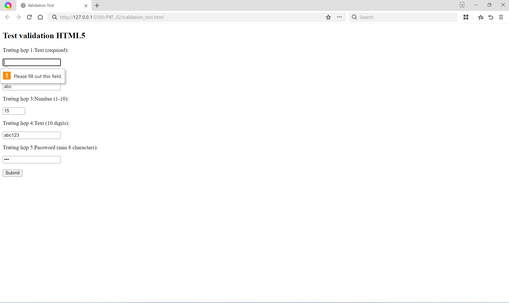

# 📋 PHIẾU BÀI TẬP 02

# **HTML5 FORMS & MEDIA — Biểu mẫu, Validation & Đa phương tiện**

> **Tài liệu tham chiếu:** `tuan_1_html5/06_graphics_multimedia.md` + `07_forms_interactive.md`

---

## PHẦN A — KIỂM TRA ĐỌC HIỂU (25 điểm)

### Câu A1 (5đ) — Input Types

10 input types khác nhau trong HTML5:

1.type="email" → Ô nhập text thông thường → Tự động kiểm tra định dạng phải có ký tự @\
→ Dùng để nhập địa chỉ email trong form đăng ký hoặc đăng nhập tài khoản.

2.type="text" → Ô nhập ký tự thông thường → Tự động kiểm tra dựa trên thuộc tính minlength, maxlength hoặc pattern\
→ Dùng để người dùng nhập "Họ và tên" trong form đăng ký hoặc địa chỉ nhận hàng trong form đặt hàng.

3.type="password" → Ô nhập ẩn ký tự (hiển thị thành dấu chấm/sao) → Tự động kiểm tra độ dài và định dạng qua minlength và pattern\
→ Dùng để người dùng nhập mật khẩu bảo mật trong trang đăng nhập hoặc tạo tài khoản mới.

4.type="number" → Ô nhập số có tích hợp nút tăng/giảm ± ở góc → Tự động kiểm tra giới hạn giá trị qua min, max và bước nhảy step\
→ Dùng trong giỏ hàng để khách hàng tăng/giảm số lượng của một mặt hàng muốn mua. (Use case ứng dụng thực tế ngoài)

5.type="tel" → Hiển thị bàn phím số chuyên dụng khi người dùng chạm vào trên thiết bị mobile
→ Kiểm tra thủ công thông qua pattern\
→ Dùng trong form thanh toán (checkout) để khách hàng nhập số điện thoại liên lạc giao hàng nhanh chóng.

6.type="date" → Hiển thị một bộ lịch (Date picker) để chọn ngày
→ Tự động kiểm tra giới hạn thời gian qua thuộc tính min, max\
→ Dùng trong form đăng ký thành viên để khách hàng nhập ngày sinh (ví dụ dùng max để xác nhận trên 18 tuổi mới được mua hàng).

7.type="radio" → Hiển thị dạng các nút chấm tròn, cho phép chọn duy nhất một đáp án trong nhiều lựa chọn
→ Có validation bắt buộc chọn thông qua required\
→ Dùng trong bước thanh toán để khách hàng chọn phương thức thanh toán (chỉ được chọn 1: COD, thẻ tín dụng, hoặc Momo) hoặc chọn giới tính.

8.type="checkbox" → Hiển thị dạng ô vuông tích chọn (có/không)
→ Có validation bắt buộc tick chọn thông qua required\
→ Dùng bắt buộc ở cuối form đăng ký tài khoản để khách hàng đánh dấu tích vào mục "Đồng ý với điều khoản dịch vụ".

9.type="search" → Ô nhập text được tối ưu cho việc tìm kiếm, thường có thêm nút ✕ để xóa nhanh nội dung
→ Không có validation tự động\
→ Dùng để làm thanh tìm kiếm sản phẩm (ví dụ: tìm "iphone") đặt ở khu vực header của trang E-commerce.

10.type="file" → Nút mở cửa sổ hệ thống để người dùng duyệt và chọn file tải lên
→ Validation qua thuộc tính accept (giới hạn loại file) và multiple (cho phép tải nhiều file)\
→ Dùng trong phần đánh giá (review) sản phẩm để khách hàng tải lên các hình ảnh hoặc video thực tế về món đồ đã nhận.

### Câu A2 (5đ) — Validation Attributes

-Trường hợp 1: `<input type="text" required value="">` (User để trống)\
+Dự đoán: Trình duyệt sẽ chặn form không cho submit và hiện thông báo lỗi ngay tại ô nhập (ví dụ: "Please fill out this field").\
+Tại sao: Thuộc tính required yêu cầu bắt buộc phải có dữ liệu trước khi gửi đi. Vì người dùng để trống nên trình duyệt tự động báo lỗi.

-Trường hợp 2: `<input type="email" value="abc">` (User gõ "abc")\
+Dự đoán: Trình duyệt chặn submit và hiện thông báo lỗi yêu cầu đúng định dạng email (ví dụ: "Please include an '@' in the email address").\
+Tại sao: Input có type="email" sẽ tự động kiểm tra định dạng và bắt buộc chuỗi nhập vào phải có ký tự @.

-Trường hợp 3: `<input type="number" min="1" max="10" value="15">` (User gõ 15)\
+Dự đoán: Trình duyệt chặn submit và hiện lỗi báo giá trị vượt quá giới hạn (ví dụ: "Value must be less than or equal to 10").\
+Tại sao: Với type="number", thuộc tính max="10" đã giới hạn giá trị lớn nhất được phép nhập là 10. Con số 15 vi phạm giới hạn này nên validation thất bại.

-Trường hợp 4: `<input type="text" pattern="[0-9]{10}" value="abc123">` (User gõ "abc123")\
+Dự đoán: Trình duyệt chặn submit và hiện cảnh báo định dạng không hợp lệ (ví dụ: "Please match the requested format").\
+Tại sao: Thuộc tính pattern sử dụng Regex (biểu thức chính quy) để kiểm tra. Ở đây,{10} yêu cầu chính xác 10 chữ số. Chuỗi "abc123" vừa chứa chữ cái vừa không đủ 10 ký tự nên bị từ chối.

-Trường hợp 5: `<input type="password" minlength="8" value="123">` (User gõ "123")\
+Dự đoán: Trình duyệt chặn submit và yêu cầu nhập đủ độ dài (ví dụ: "Please lengthen this text to 8 characters or more").\
+Tại sao: Thuộc tính minlength="8" quy định mật khẩu phải có độ dài tối thiểu là 8 ký tự. "123" chỉ có 3 ký tự nên không hợp lệ.



### Câu A3 (5đ) — Accessibility

1. Tại sao `<label for="email">` quan trọng cho người dùng screen reader?\
   Thẻ `<label>` có thuộc tính for phải luôn khớp chính xác với id của thẻ `<input>`. Sự liên kết này cực kỳ quan trọng vì:\
   Nếu không có `<label>` hoặc liên kết sai, trình đọc màn hình (screen reader) sẽ không biết ô nhập đó dùng để làm gì. Người dùng khiếm thị sẽ chỉ nghe thấy thông báo chung chung là "edit text" mà không biết phải nhập thông tin gì vào đó.
   Hậu quả là người khiếm thị sẽ không thể sử dụng được form của bạn.\
   Ngoài ra, việc dùng đúng `<label for>` còn tăng trải nghiệm người dùng (UX) vì khi click vào dòng chữ của label, trình duyệt sẽ tự động focus (nháy con trỏ) vào trong ô input tương ứng.

2. Khi nào dùng `<fieldset>` + `<legend>`? Cho ví dụ cụ thể.

Dùng `<fieldset>` và `<legend>` khi cần nhóm các lựa chọn có liên quan với nhau, đặc biệt là đối với các tập hợp nhóm radio buttons hoặc checkboxes.

`<fieldset>`: Dùng để bao bọc/gom nhóm toàn bộ các lựa chọn.\
`<legend>`: Đóng vai trò là tiêu đề/câu hỏi chung cho toàn bộ nhóm đó.\
Ví dụ cụ thể: Nhóm các nút radio để chọn giới tính.

```
    <fieldset>
    <legend>Chọn giới tính của bạn:</legend>
    <label><input type="radio" name="gender" value="nam"> Nam</label>
    <label><input type="radio" name="gender" value="nu"> Nữ</label>
    <label><input type="radio" name="gender" value="khac"> Khác</label>
    </fieldset>
```

3. aria-label dùng khi nào? Tại sao KHÔNG nên dùng aria-label khi đã có `<label>`?

   Dùng aria-label khi: Thuộc tính này được dùng để cung cấp một nhãn (nhưng không hiển thị ra màn hình) cho trình đọc màn hình đọc lên. Nó thường được dùng trong các trường hợp UI không có văn bản hiển thị trực quan. Ví dụ: Một nút bấm tìm kiếm chỉ có icon hình kính lúp (không có chữ "Tìm kiếm") hoặc nút đóng popup chỉ có icon dấu "X".

   Tại sao KHÔNG nên dùng khi đã có `<label>`: Nếu một ô input đã có thẻ `<label>` hiển thị rõ ràng (liên kết bằng for), việc khai báo thêm aria-label là thừa thãi. Nguy hiểm hơn, thuộc tính aria-label sẽ ghi đè (override) nội dung của thẻ `<label>` đối với screen reader. Điều này có thể dẫn đến việc người dùng nhìn màn hình thì thấy một thông tin, nhưng người dùng screen reader lại nghe thành một thông tin khác, gây ra sự thiếu đồng bộ và nhầm lẫn nghiêm trọng. Tốt nhất là chỉ sử dụng thẻ `<label>` gốc của HTML.

### Câu A4 (5đ) — Media

1. Thuộc tính loading="lazy" trên thẻ ``\
   -Thuộc tính loading="lazy" (Lazy loading) chỉ đạo trình duyệt chỉ tải hình ảnh khi người dùng cuộn chuột (scroll) đến vùng chứa ảnh đó thay vì tải toàn bộ ngay từ đầu.\
   -Điều này giúp cải thiện tốc độ tải trang ban đầu (Page Load Speed) và tiết kiệm băng thông (Bandwidth) hiệu quả.\
   -Khi KHÔNG nên dùng: Tuyệt đối không lazy load các ảnh "above the fold" (những hình ảnh đầu tiên người dùng nhìn thấy ngay khi mở web như LCP image, ảnh hero, logo). Nếu dùng lazy cho những ảnh này, trình duyệt sẽ bị trì hoãn việc hiển thị, làm giảm điểm số LCP (Largest Contentful Paint) và gây trải nghiệm xấu.

2. Nhiều `<source>` trong thẻ `<video>` và format phổ biến\
   -Tại sao cung cấp nhiều `<source>`: Việc sử dụng nhiều thẻ `<source>` giúp trình duyệt tự động chọn định dạng video phù hợp nhất mà nó hỗ trợ để phát. Điều này đảm bảo video của bạn hoạt động mượt mà trên mọi loại trình duyệt.\
   -Format video web phổ biến: MP4, Ogg và WebM.

3. Thuộc tính alt trên `` và cách viết\
   -Mục đích: Thuộc tính alt dùng để mô tả nội dung của bức ảnh cho các trình đọc màn hình (screen reader) giúp người khiếm thị có thể hiểu được, và hiển thị đoạn text thay thế khi file ảnh bị lỗi không thể tải.

   -Viết alt tốt cho 3 trường hợp:\
   +Ảnh sản phẩm iPhone 16: alt="Điện thoại Apple iPhone 16 Pro màu Titan tự nhiên"\
   +Ảnh trang trí (decorative): Dùng alt="" (chuỗi rỗng). Việc để alt rỗng là hoàn toàn hợp lệ cho ảnh trang trí thuần túy, điều này giúp các trình đọc màn hình biết và bỏ qua nó, không gây nhiễu thông tin.\
   +Ảnh biểu đồ doanh thu Q1/2026: alt="Biểu đồ cột biểu diễn mức tăng trưởng doanh thu quý 1 năm 2026 đạt 50 tỷ"

### Câu A5 (5đ) — So sánh `<figure>` vs ``

1. Khi nào dùng Cách 1 (`` độc lập)?\
   Sử dụng thẻ `` đơn độc khi hình ảnh chỉ mang tính chất hiển thị cơ bản, ảnh trang trí, hoặc nội dung bức ảnh đã hòa vào ngữ cảnh của các thẻ xung quanh mà không cần một dòng chú thích (caption) gắn liền riêng biệt.

   2 Ví dụ thực tế cho Cách 1:\
   -Icon tạo giỏ hàng trên header:
   ``\
   -Ảnh logo thương hiệu:
   ``

2. Khi nào dùng Cách 2 (`<figure>` kết hợp `<figcaption>`)?\
   Sử dụng `<figure>` khi bức ảnh (hoặc video, biểu đồ) là một khối nội dung độc lập trọn vẹn và bạn bắt buộc phải có một dòng chú thích (`<figcaption>`) gắn chặt với nó. Về mặt Semantic HTML (ngữ nghĩa), việc dùng thẻ này giúp công cụ tìm kiếm (Google) và trình đọc màn hình hiểu chắc chắn rằng dòng chữ bên trong `<figcaption>` chính là mô tả dành riêng cho bức ảnh đó.

   2 Ví dụ thực tế cho Cách 2:\
   -Card sản phẩm trong trang bán hàng:

```
   <figure>
    
    <figcaption>Nike Air Force 1 — 2.500.000đ</figcaption>
   </figure>
```

-Ảnh sản phẩm kèm mô tả chi tiết:

```
<figure>
 
 <figcaption>MacBook Air M2 — Siêu mỏng nhẹ</figcaption>
</figure>
```

## PHẦN C — PHÂN TÍCH & SUY LUẬN (20 điểm)

### Câu C1 (10đ) — Debug Form

Lỗi 1: Dòng 2 — Input "Tên" không có `<label for="">`,
vi phạm accessibility (screen reader không hiểu field)
Sửa:

```
<label for="name">Tên:</label>
<input type="text" id="name" name="name" required>
```

Lỗi 2: Dòng 2 — Input "Tên" thiếu name và required,
không gửi dữ liệu về server + không validate
Sửa:

```
<input type="text" id="name" name="name" required>
```

Lỗi 3: Dòng 4 — Email không có `<label>`,
accessibility kém
Sửa:

```
<label for="email">Email:</label>
<input type="email" id="email" name="email" placeholder="Email của bạn" required>
```

Lỗi 4: Dòng 6-7 — Password không có `<label>`,
người dùng không biết field nào là gì
Sửa:

```
<label for="password">Mật khẩu:</label>
<input type="password" id="password" name="password" required>

<label for="confirm">Nhập lại mật khẩu:</label>
<input type="password" id="confirm" name="confirm" required>
```

Lỗi 5: Dòng 9 — Phone dùng type="text",
không đúng semantic, không hỗ trợ bàn phím số
Sửa:

```
<label for="phone">Phone:</label>
<input type="tel" id="phone" name="phone" pattern="[0-9]{10}" placeholder="Nhập số điện thoại">
```

Lỗi 6: Dòng 9 — Phone dùng value cứng,
không nên pre-fill dữ liệu người dùng
Sửa:

```
<input type="tel" id="phone" name="phone" placeholder="Nhập số điện thoại">
```

Lỗi 7: Dòng 11 — `<select>` không có `<label>`,
accessibility kém
Sửa:

```
<label for="city">Thành phố:</label>
<select id="city" name="city">

<option>Hà Nội</option>
<option>TP.HCM</option>
</select>
```

Lỗi 8: Dòng 16 — Checkbox thiếu input + không liên kết label,
không thể tick + không usable
Sửa:

```
<input type="checkbox" id="terms" name="terms" required>
<label for="terms">Tôi đồng ý điều khoản</label>
```

### Câu C2 (10đ) — Thiết kế chiến lược Validation

1.-pattern regex cho CMND/CCCD:\
pattern="^[0-9]{12}$"

-pattern regex cho Số tài khoản:\
pattern="^[0-9]{10,15}$"

2.HTML5 validation không đủ an toàn cho ứng dụng ngân hàng\
-Vì: Frontend valication chỉ để hỗ trợ UX, không đảm bảo bảo mật

3.3 loại valication mà HTML5 KHÔNG THỂ làm được(phải dùng JavaScript)\
-So sánh giữa các field\
-Kiểm tra dữ liệu từ server\
-Valication logic phức tạp

4.2 rủi ro bảo mật nếu chỉ validate trên Frontend mà không validate Backend:\
-Bypass valication(vượt qua kiểm tra)\
-Injection attack(tấn công chèn mã)
