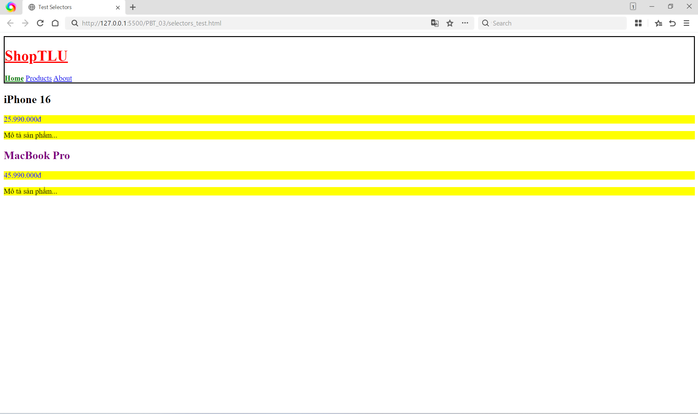
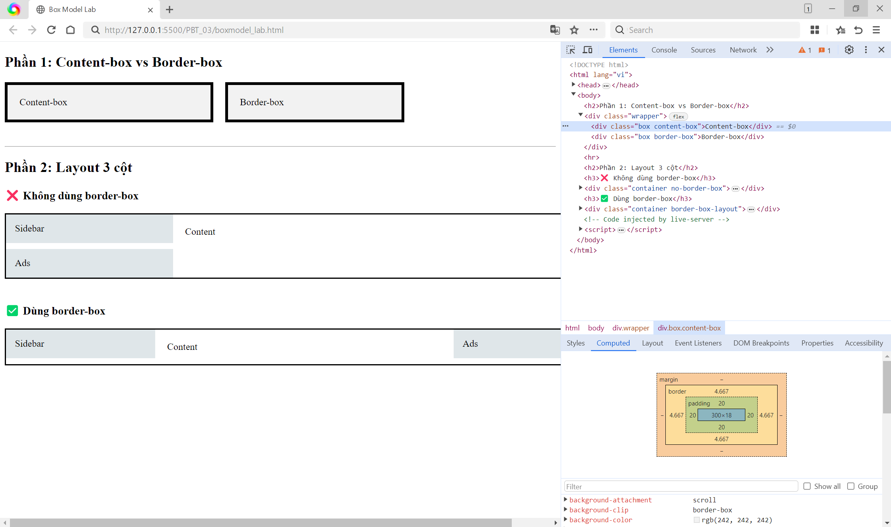
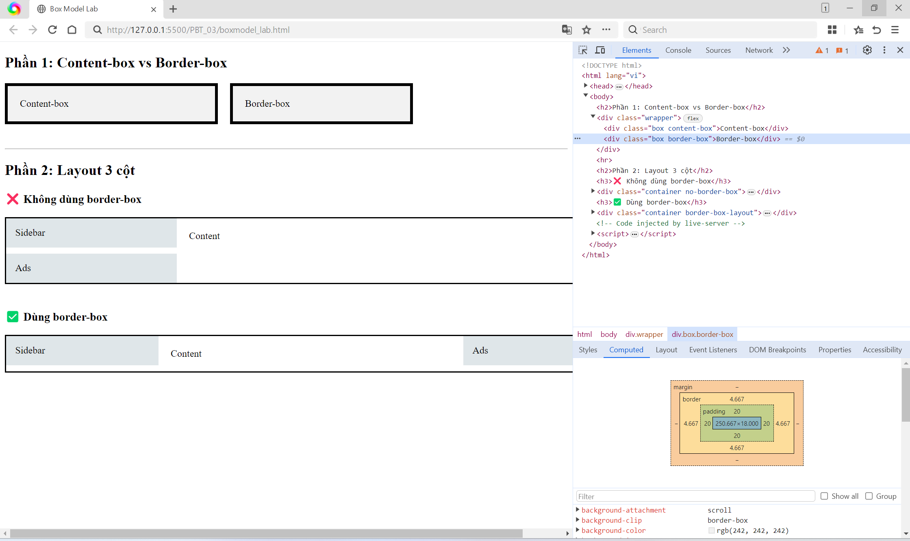
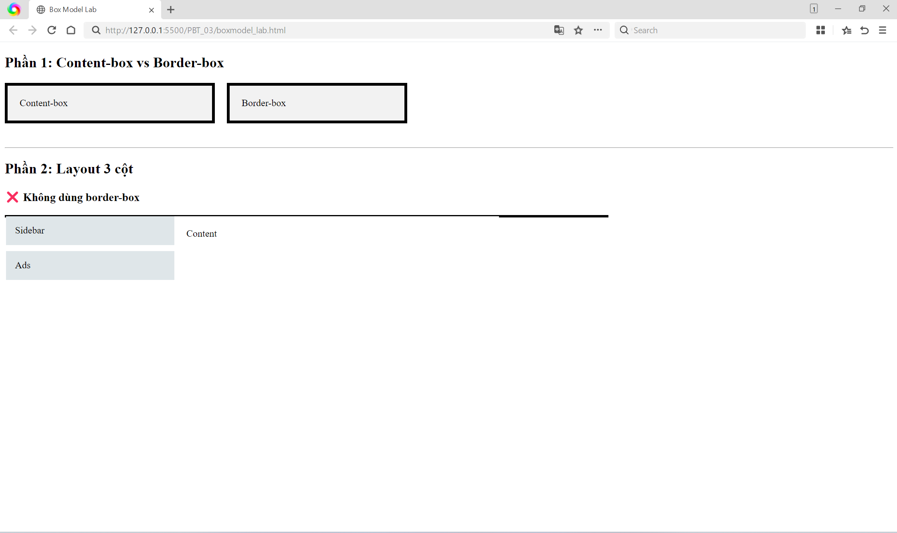
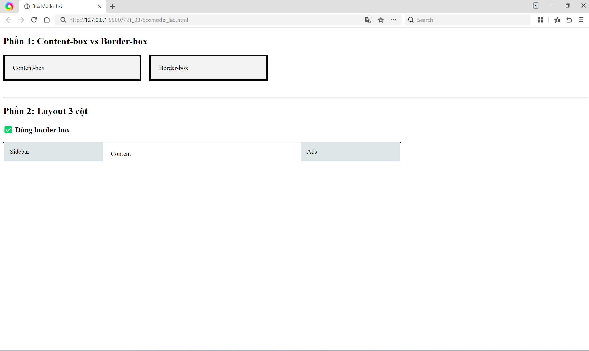
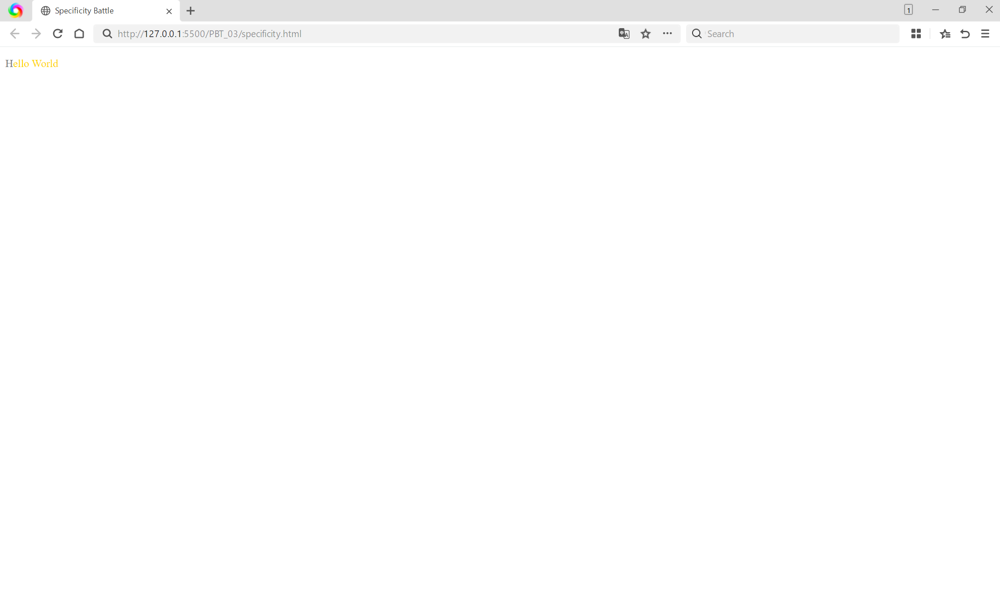
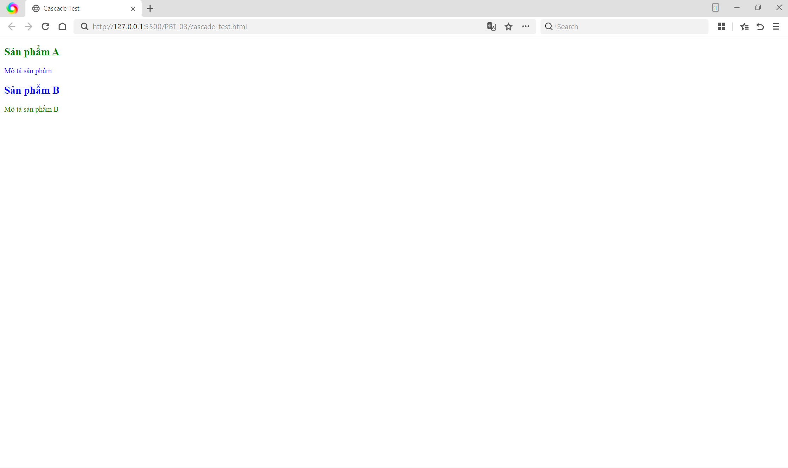

# 📋 PHIẾU BÀI TẬP 03

# **CSS CORE — Selectors, Box Model, Inheritance & Cascade**

> **Tài liệu tham chiếu:** `tuan_2_css_core/08_introduction_css.md` → `11_box_model.md`

---

## PHẦN A — KIỂM TRA ĐỌC HIỂU (25 điểm)

### Câu A1 (5đ) — 3 Cách nhúng CSS

3 cách nhúng CSS vào HTML (inline, internal, external):

1. External CSS (CSS Ngoại tuyến)\
   Ví dụ code:\
   HTML:

`<link rel="stylesheet" href="style.css">`

`<p>Hello</p>`

Css:

```
p {
  color: green;
  font-size: 18px;
 }
```

-Ưu điểm:\
+Caching: Trình duyệt lưu cache file CSS, nên khi chuyển sang trang 2, trang 3 sẽ load ngay lập tức mà không phải tải lại.\
+Tái sử dụng: Dùng chung một file CSS cho hàng chục trang, chỉ cần sửa một chỗ là giao diện thay đổi toàn bộ.\
+Dễ bảo trì (Maintainability): Tách biệt cấu trúc (HTML) và giao diện (CSS) giúp team có thể làm việc song song hiệu quả.
+Hiệu suất: File có thể được tối ưu hóa (minified) để giảm dung lượng, giúp tải trang cực nhanh.

-Nhược điểm: Phải quản lý thêm nhiều file riêng biệt
-Khi nào dùng: Luôn được ưu tiên cao nhất, đây là tiêu chuẩn bắt buộc cho các dự án thực tế (production).

2. Internal CSS (CSS Nội bộ)\
   Ví dụ code:

```
<!DOCTYPE html>
 <html>
 <head>
   <style>
     p {
       color: blue;
       font-size: 18px;
     }
   </style>
 </head>
 <body>
   <p>Hello</p>
 </body>
 </html>
```

-Ưu điểm: Gom toàn bộ code (HTML và CSS) vào một file duy nhất, tiện lợi để test nhanh.\
-Nhược điểm: Không thể tái sử dụng cho các trang HTML khác, làm cho file HTML trở nên cồng kềnh, khó quản lý nếu project lớn.\
-Khi nào dùng: Chỉ nên dùng khi làm bản nháp (prototype) hoặc cho trang web chỉ có duy nhất một trang (single-page).

3. Inline CSS (CSS Nội tuyến)\
   Ví dụ code: `<p style="color: red; font-size: 18px;">Hello</p>`
   -Ưu điểm: Nhanh gọn, tác động trực tiếp và ngay lập tức lên một phần tử cụ thể.\
   -Nhược điểm: Inline CSS không được cache riêng như file CSS (vì nó nằm trong HTML, phải tải lại mỗi lần load trang), không thể tái sử dụng, code bị lặp lại và cực kỳ khó debug hay bảo trì.\
   -Khi nào dùng: Phải hạn chế tối đa (tránh dùng). Chỉ dùng trong trường hợp khẩn cấp hoặc khi cần ghi đè (override) style tạm thời.

---

Câu hỏi thêm: Nếu cùng 1 element có cả 3 cách CSS đồng thời áp dụng, cách nào "thắng"? Giải thích tại sao.

Trả lời: Inline CSS sẽ là cách "thắng" (áp dụng ưu tiên nhất), sau đó mới tới Internal và External (nằm dưới cùng).
Giải thích tại sao: Inline CSS dùng để "override (ghi đè) tạm thời" và quy tắc ưu tiên trong CSS phụ thuộc vào "specificity (độ đặc tả)" và "Cascade (xếp tầng)". Inline CSS được viết trực tiếp lên chính thẻ HTML đó nên nó có điểm đặc tả (Specificity) cao nhất. Nó sẽ luôn ghi đè các luật (rules) đến từ Internal CSS (thẻ `<style>`) và External CSS (file .css), ngoại trừ trường hợp một rule khác có sử dụng từ khóa !important.

### Câu A2 (8đ) — CSS Selectors — Dự đoán kết quả

1. h1 → Chọn: ShopTLU
2. .price → Chọn: 25.990.000đ, 45.990.000đ
3. #app header → Chọn: ShopTLU + Home + Products + About
4. nav a:first-child → Chọn: Home
5. .product.featured h2 → Chọn: MacBook Pro
6. article > p → Chọn: 4 dòng p trong article
7. a[href="/"] → Chọn: Home
8. .top-bar.dark h1 → Chọn: ShopTLU
   

### Câu A3 (7đ) — Box Model — Tính toán kích thước

- Trường hợp 1: content-box (mặc định)

```
.box-1 {
width: 400px;
padding: 20px;
border: 5px solid black;
margin: 10px;
}
```

→ Chiều rộng hiển thị = width + padding*2 + border*2 = 400 + (20×2) + (5×2) = 450px
→ Không gian chiếm trên trang = Chiều rộng hiển thị + 2 bên margin = 450 + (10×2) = 470px

- Trường hợp 2: border-box \_

```
.box-2 {
box-sizing: border-box;
width: 400px;
padding: 20px;
border: 5px solid black;
margin: 10px;
}
```

→ Chiều rộng hiển thị = 400px (Với border-box, width đã bao gồm padding + border)
→ Kích thước content thực tế = width - padding*2 - border*2 = 400 - 40 - 10 = 350px
→ Không gian chiếm trên trang = Chiều rộng hiển thị + 2 bên margin = 400 + (10×2) = 420px

- Trường hợp 3: Margin collapse

```
.box-a { margin-bottom: 25px; }
.box-b { margin-top: 40px; }
```

→ Khoảng cách giữa box-a và box-b = max(25, 40) = 40px
→ Giải thích tại sao KHÔNG PHẢI 65px: Đây là hiện tượng Margin Collapse (Margin bị nuốt). Khi hai block element nằm theo chiều dọc kế tiếp nhau, khoảng cách margin dọc giữa chúng không được cộng dồn mà sẽ bị gộp lại và lấy giá trị LỚN HƠN (trong trường hợp này là lấy 40px thay vì 25px).
Mục đích để tránh khoảng cách bị "phóng đại" và layout gọn gàng hơn.

Nâng cao: Nếu .box-a có margin-bottom: -10px và .box-b có margin-top: 40px, khoảng cách = 40 + (-10) = 30px

### Câu A4 (5đ) — Specificity (Độ ưu tiên)

```
p { color: black; }                   /* Rule A */
.price { color: blue; }               /* Rule B */
#main-price { color: red; }           /* Rule C */
p.price { color: green; }             /* Rule D */
```

1.Specificity score (a, b, c) cho mỗi rule
Quy ước:
a = số lượng id
b = số lượng class, attribute, pseudo-class
c = số lượng tag

Rule A (p): (0, 0, 1)
Rule B (.price): (0, 1, 0)
Rule C (#main-price): (1, 0, 0)
Rule D (p.price): (0, 1, 1)

2.Element sẽ có màu gì? Giải thích\
-Element sẽ có màu đỏ (red).\
-Giải thích: Theo nguyên tắc Cascade trong CSS, khi xảy ra xung đột (các rule cùng nhắm vào một thẻ), trình duyệt sẽ áp dụng rule có điểm specificity cao nhất.\
So specificity:
#main-price (1,0,0) > p.price (0,1,1) > .price (0,1,0) > p (0,0,1)

3.Nếu thêm `<p class="price" id="main-price" style="color: orange;">`, element có màu gì?\
-Element sẽ chuyển sang màu cam (orange).\
-Giải thích: Thuộc tính style="" (Inline style) có độ ưu tiên cao thứ hai trong hệ thống phân cấp (tương đương 1000 điểm), mạnh hơn bất kỳ ID, Class hay Tag selector nào viết trong file CSS

4.Nếu Rule A thêm !important, element có màu gì? Tại sao?\
-Element sẽ chuyển thành màu đen (black).\
-Giải thích: Khai báo !important là cấp độ ưu tiên tối cao nhất trong CSS (điểm vô hạn).
!important (so với nhau theo specificity)> inline (không !important)> id > class > tag

---

## PHẦN B — THỰC HÀNH CODE (55 điểm)

### Bài B1 (20đ) — Style trang Profile

## Các loại selector đã sử dụng:

1. Element selector:
   - body, header, nav, table, footer

2. Class selector:
   - .active

3. ID selector:
   - #about, #skills, #contact

4. Descendant selector:
   - nav a
   - tbody tr

5. Pseudo-class:
   - :hover
   - :nth-child(even)

### Bài B2 (20đ) — Box Model Lab

## Phần 1 — Box Model

Hộp 1 (content-box): Chiều rộng thực tế ≈ 350px

Hộp 2 (border-box): Chiều rộng thực tế = 300px


Giải thích:

- content-box: width chỉ tính content → phải cộng thêm padding + border\
  width = 300px\
  padding = 20px × 2 = 40px\
  border = 5px × 2 = 10px\
  → Tổng = 300 + 40 + 10 = 350px

- border-box: width đã bao gồm padding + border → giữ nguyên kích thước

## Phần 2 — Layout 3 cột

Trường hợp KHÔNG dùng border-box:\
Hộp content-box bị tràn vì: width chỉ tính content, không bao gồm padding + border\
→ Tổng thực tế lớn hơn 1000px nên layout bị vỡ\
Ví dụ:\
Sidebar = 250 + 30 = 280px\
Content = 500 + 40 = 540px\
Ads = 250 + 30 = 280px\
→ Tổng = 1100px > 1000px


Trường hợp dùng border-box:\
Tổng = 250 + 500 + 250 = 1000px\
Hộp border-box:
width đã bao gồm padding + border

→ Tổng đúng 1000px nên layout hiển thị chuẩn

Kết luận:

- content-box làm tăng kích thước thực tế
- border-box giúp giữ layout chính xác

### Bài B3 (15đ) — Specificity Battle

1. Liệt kê 10 rules + specificity score

   -1. p → (0,0,1)

   -2. p::first-letter → (0,0,2)

   -3. .text → (0,1,0)

   -4. .highlight → (0,1,0)inheritance

   -5. p.text → (0,1,1)

   -6. .text.highlight → (0,2,0)

   -7. p.text.highlight → (0,2,1)

   -8. #demo → (1,0,0)

   -9. #demo.text → (1,1,0)

   -10. #demo.text.highlight → (1,2,0)

2. -Element cuối cùng hiển thị màu **gold**\
   -Vì:Rule có specificity cao nhất là:#demo.text.highlight → (1,2,0)\
   → Cao hơn tất cả các rule khác nên được áp dụng

3. Chụp screenshot kết quả
   

4. Nếu thay đổi thứ tự rules trong CSS file:

- Nếu KHÔNG có rule nào cùng specificity:\
  → Kết quả KHÔNG đổi

- Nếu có 2 rule cùng specificity:\
  → Rule viết SAU sẽ thắng (theo Cascade)

Kết luận:

- Specificity quyết định chính
- Thứ tự chỉ ảnh hưởng khi specificity bằng nhau

---

## PHẦN C — DEBUG & SUY LUẬN (20 điểm)

### Câu C1 (10đ) — Debug CSS Layout

-Chiều rộng thực tế của sidebar = 300 + 20*2 + 1*2 = 342px\
-Chiều rộng thực tế của content (content-box!) = 660 + 30*2 + 1*2 = 722px\
Tổng = 342 + 722 = 1064px

-Layout bị vỡ vì tổng chiều rộng 1064px > 960px

-2 cách sửa khác nhau:\
+Cách dùng border-box: Sidebar=300px; Content=660px\
Tổng=300+660=960px

+Cách không dùng border-box: Phải trừ padding + border ra khỏi width.\
Sidebar=300 - (20*2 + 1*2) = 258px\
Content=660 - (30*2 + 1*2) = 598px

```
.sidebar {
width: 258px;
padding: 20px;
border: 1px solid #ccc;
float: left;
}
.content {
width: 598px;
padding: 30px;
border: 1px solid #ccc;
float: left;
}
```

### Câu C2 (10đ) — Cascade Puzzle

1."Sản phẩm A" (h2)

-Quá trình cascade + inheritance:\
body → 16px\
.container → 14px (inherit xuống)\
.card .title → 20px (apply trực tiếp lên h2)

=>có font-size = 20px

```
body { color: #333; }
.card { color: blue; }
#featured .title { color: red; }
.highlight { color: green !important; }
```

Selector Specificity\
.card (0-0-1)\
#featured .title (0-1-1)\
.highlight (0-0-1) nhưng có !important

=>color = green

2."Mô tả sản phẩm" (p trong card featured)

```
.card { color: blue; }
.card p { color: inherit; }
```

-inheritance:\
p nằm trong .card, mà .card có: `color: blue;`\
Sau đó:
`.card p { color: inherit; }`\
inherit nghĩa là:\
lấy giá trị từ parent\
Parent của p là .card, có color: blue.

=> color = blue

3."Sản phẩm B" (h2) có font-size = ? và color = ?\
`<h2 class="title">Sản phẩm B</h2>`\
`.card .title { font-size: 20px; }`\
=>font-size = 20px

```
body { color: #333; }
.card { color: blue; }
```

h2 không có rule color riêng\
→ inherit từ .card\
=> color = blue

4."Mô tả sản phẩm B" (p.highlight) có color = ?\
`<p class="highlight">...</p>`\
`.highlight { color: green !important; }`\
=>color = green

file HTML+CSS kiểm chứng và chụp screenshot.


---

## 🎬 PHẦN D — VIDEO THỰC HÀNH OBS (25 điểm)

https://drive.google.com/file/d/12bv-dNsaVRl4_Xth3zwon2f8jGamhigg/view?usp=sharing
