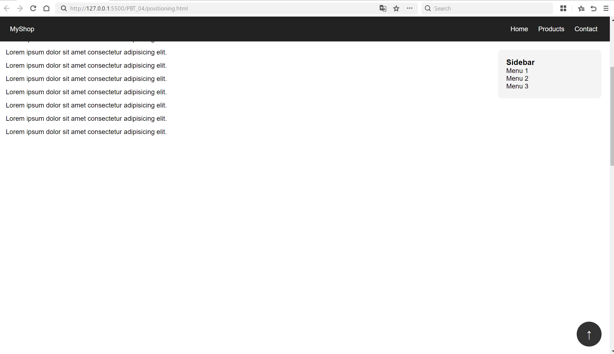
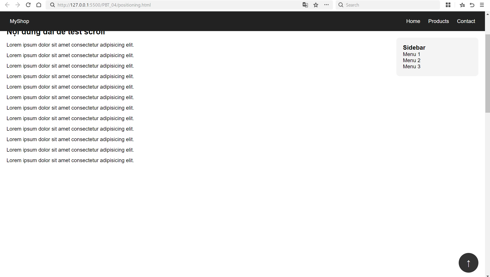
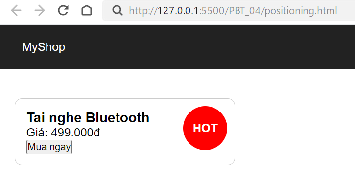
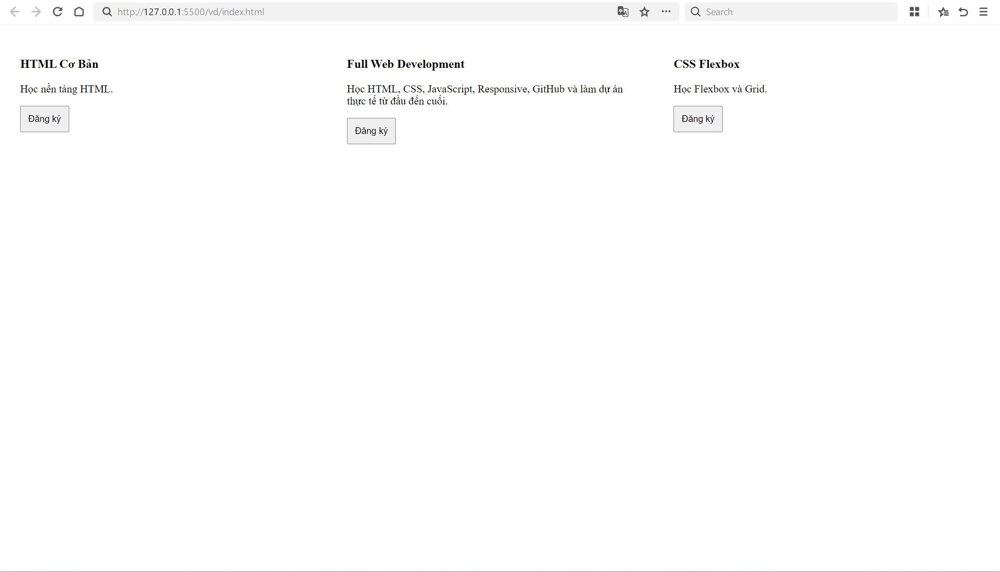
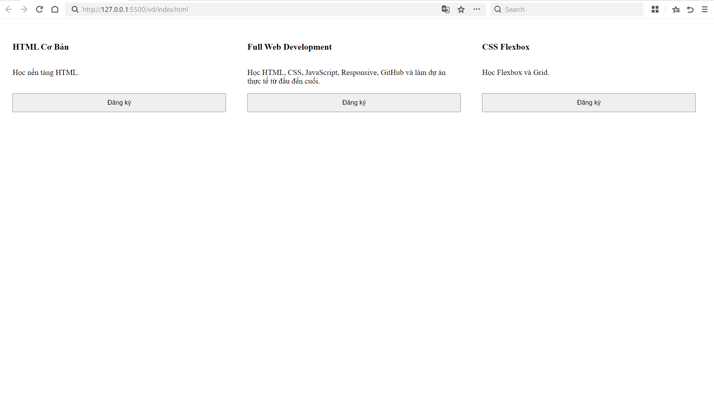
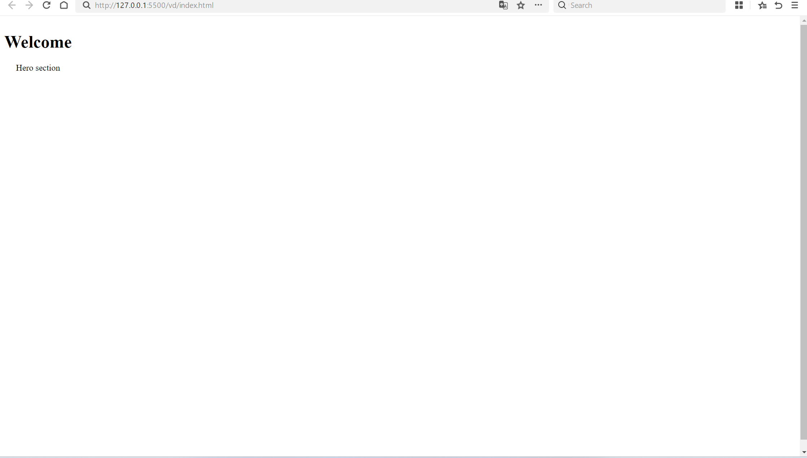
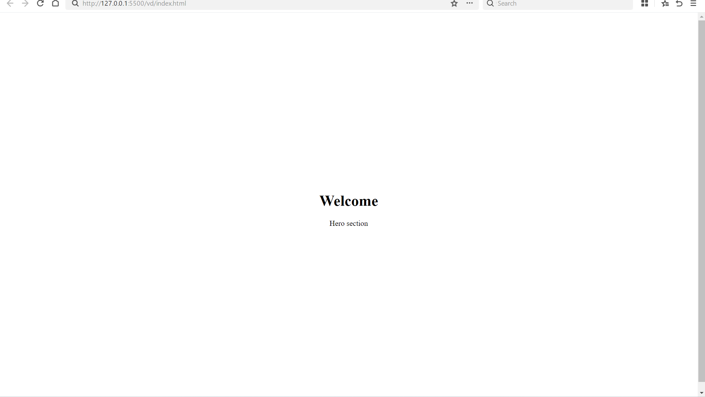
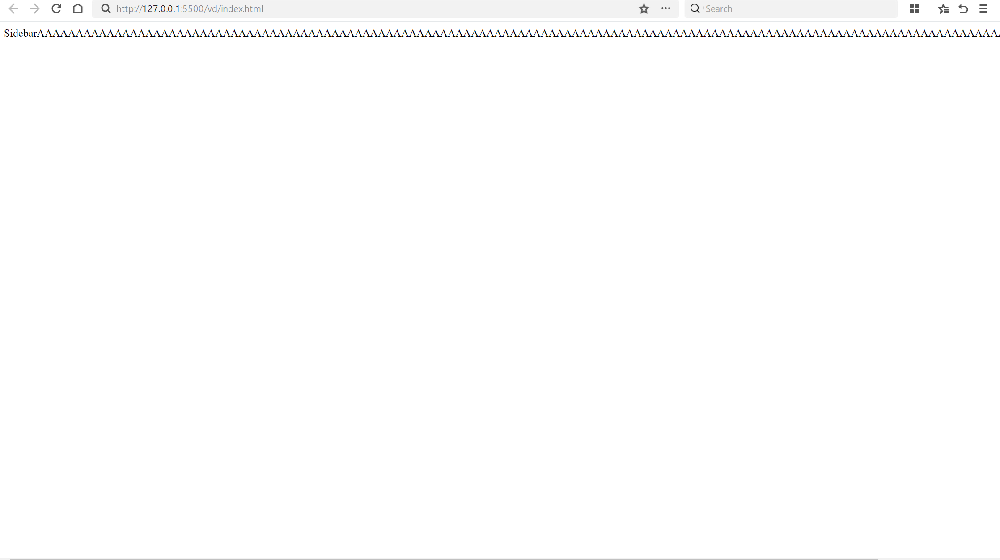
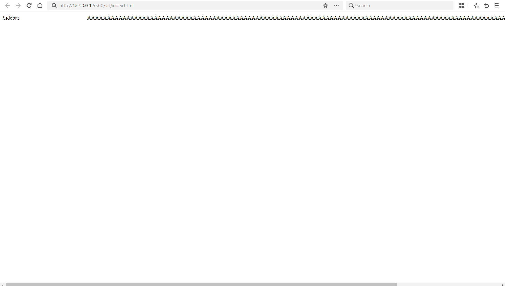

# 📋 PHIẾU BÀI TẬP 04

# **CSS LAYOUT — Positioning, Flexbox & Grid**

> **Tài liệu tham chiếu:** `tuan_2_css_core/12_css_positioning.md` + `tuan_3_css_advanced/13_creating_responsive_layouts.md`

---

## PHẦN A — KIỂM TRA ĐỌC HIỂU (20 điểm)

### Câu A1 (10đ) — 5 Loại Positioning

| Position   | Vẫn chiếm chỗ trong flow? | Tham chiếu vị trí     | Cuộn theo trang?         | Use case                                    |
| ---------- | ------------------------- | --------------------- | ------------------------ | ------------------------------------------- |
| `static`   | có                        | Không dùng            | Có                       | Mặc định                                    |
| `relative` | có                        | Vị trí gốc của nó     | Có                       | Làm điểm tọa độ (anchor)cho absolute con    |
| `absolute` | không                     | Cha relative gần nhất | Có                       | Badge,dropdown,tooltip,overlay              |
| `fixed`    | không                     | Viewport(Màn hình)    | Không                    | Chat button, cookie banner, header cố định  |
| `sticky`   | có                        | Viewport(khi dính)    | Cuộn tới ngưỡng thì dính | Sticky header, sticky table header, sidebar |

- `absolute` tham chiếu `body` khi: không có bất kỳ phần tử cha nào được thiết lập thuộc tính position (tức là tất cả các cha đều là static mặc định). Khi đó, element bị đặt tọa độ theo toàn bộ trang thay vì theo 1 phần tử cha.

- Tham chiếu parent khi: phần tử cha đó được thiết lập 1 giá trị position khác static, phổ biến nhất là position: relative. Lúc này, cha sẽ đóng vai trò làm gốc tọa độ (0,0) để absolute biết cần tính toán vị trí từ đâu.

- Khái niệm "nearest positioned ancestor" là: 1 phần tử có position: absolute không nhất thiết phải bám vào thẻ cha trực tiếp của nó. Thay vào đó, trình duyệt sẽ áp dụng quy tắc: dò ngược lên trên cấu trúc HTML(từ cha, lên ông nội,...) cho đến khi tìm thấy phần tử cha gần nhất có thuộc tính position ≠ static (như relative, absolute, fixed, sticky). Phần tử đầu tiên thỏa mãn điều kiện đó chính là "nearest positioned ancestor", và nó sẽ được dùng làm mốc tọa độ neo giữu vị trí cho phần tử absolute.

### Câu A2 (10đ) — Flexbox vs Grid

- Trường hợp 1:\
  +------+------+------+------+\
  |item1 |item2 |item3 |item4 |\
  +------+------+------+------+

  4 items -> Bố cục = 1 hàng, 4 cột bằng nhau

- Trường hợp 2:\
  +-------+-------+\
  | item1 | item2 |\
  +-------+-------+\
  +-------+-------+\
  | item3 | item4 |\
  +-------+-------+\
  +-------+-------+\
  | item5 | item6 |\
  +-------+-------+

6 items -> Bố cục = 3 hàng, 2 cột

- Trường hợp 3:\
  |item1 item2 item3|

  3 items -> Bố cục = 1 hàng, 3 items nằm cách đều nhau ra 2 mép và căn giữa theo chiều dọc.

- Trường hợp 4:\
  +--------+------------------+--------+\
  | item1 | item2 | item3 |\
  | 200px | 1fr | 200px |\
  +--------+------------------+--------+

  3 items -> Bố cục = 1 hàng, 3 cột với khoảng cách 20px giữa các cột

- Trường hợp 5:\
   +-------+-------+-------+\
   | item1 | item2 | item3 |\
   +-------+-------+-------+\
  +-------+-------+-------+\
  | item4 | item5 | item6 |\
  +-------+-------+-------+\
  +-------+-------+-------+\
  | item7 | | |\
  +-------+-------+-------+

7 items -> Bố cục = 3 hàng, 3 cột (mỗi cột kích thước bằng nhau)

---

## PHẦN B — THỰC HÀNH CODE (60 điểm)

### Bài B1 (15đ) — Positioning Playground





### Bài B2 (20đ) — Flexbox Navigation & Cards

### Bài B3 (25đ) — Grid Layout — Trang E-Commerce

---

## PHẦN C — SUY LUẬN (20 điểm)

### Câu C1 (10đ) — Flexbox vs Grid: Khi nào dùng gì?

Câu C1 (10đ) — Flexbox vs Grid: Khi nào dùng gì?
Cho 5 tình huống layout thực tế. Với mỗi tình huống, trả lời: dùng Flexbox, Grid, hay kết hợp cả hai? Giải thích ngắn gọn tại sao.

1. Navigation bar ngang (logo + menu + buttons)\
   -Dùng: Flexbox\
   -Vì: Navbar là layout 1 chiều(hàng ngang). \
   Flexbox rất hợp để căn hàng ngang, canh giữa và tạo khoảng cách giữa các phần tử(justify, align-items)

2. Lưới ảnh Instagram (3 cột đều nhau, số ảnh không biết trước)\
   -Dùng: Grid\
   -Vì: Đây là bố cục 2 chiều(hàng+cột). Grid giúp tạo lưới đều nhau rất dễ bằng\
   grid-template-columns: repeat(3,1fr). Ảnh tự xuống hàng khi thêm item mới.

3. Layout blog: main content + sidebar\
   -Dùng: Grid\
   -VÌ: Blog thường có cấu trúc rõ ràng: nội dung chính + sidebar. Grid mạnh trong việc chia các vùng layout như 1fr 300px. Dễ kiểm soát chiều rộng từng khu vực.

4. Footer với 4 cột thông tin (Về chúng tôi, Liên kết, Hỗ trợ, Liên hệ)\
   -Dùng: Grid (hoặc Flexbox nếu đơn giản)\
   -Vì: Footer nhiều cột đều nhau → Grid trực quan hơn để chia 4 cột cố định. Nếu chỉ cần xếp ngang đơn giản thì Flexbox cũng làm được, nhưng Grid dễ quản lý hơn khi responsive.

5. Card sản phẩm (ảnh trên, text giữa, nút dưới — nút luôn dính đáy)\
   -Dùng: Kết hợp Flexbox + Grid\
   -Vì: Thường Grid dùng để sắp nhiều card thành lưới. Bên trong từng card dùng Flexbox theo chiều dọc (flex-direction: column) để đẩy nút xuống đáy bằng margin-top: auto.

### Câu C2 (10đ) — Debug Flexbox

Lỗi 1: Cards không đều chiều cao — nút "Mua" bị nhảy lên/xuống\
-Hiện tượng: +Card có nội dung dài/ngắn khác nhau
+Nút "Mua" bị lệch lên xuống\
-Nguyên ngân: +.card chưa dùng Flexbox theo chiều dọc\
+Nút .btn đang nằm ngay sau nội dung nên:\
card nào nhiều text → nút bị đẩy xuống\
card nào ít text → nút nằm cao hơn

Code sửa:

```
.card-container {
    display: flex;
    flex-wrap: wrap;
}

.card {
    width: 30%;
    margin: 1.5%;

    display: flex;
    flex-direction: column;
}

.card img {
    width: 100%;
}

.card h3 {
    font-size: 18px;
}

.card .btn {
    padding: 10px;

    margin-top: auto;
}
```




Lỗi 2: Muốn items nằm giữa cả ngang lẫn dọc trong container 100vh, nhưng item vẫn dính góc trái trên\
-Hiện tượng: Muốn nội dung nằm chính giữa màn hình nhưng vẫn dính góc trái trên.\
-Nguyên nhân: Container\
+Container .hero có display: flex nhưng:\
chưa có justify-content\
chưa có align-items

+Flex mặc định: ngang → flex-start\
dọc → stretch\
nên item nằm góc trái trên.

Code sửa:

```
.hero {
height: 100vh;
display: flex;

    justify-content: center;
    align-items: center;

}

.hero-content {
text-align: center;
}
```




Lỗi 3: Sidebar bị co lại khi content quá dài\
-Hiện tượng: Khi content quá dài: sidebar bị ép nhỏ hơn 250px\
-Nguyên nhân: Trong Flexbox: item mặc định có thể bị co (flex-shrink: 1)\
Nên .sidebar bị shrink khi .content quá lớn.

Code sửa:

```
.layout {
display: flex;
}

.sidebar {
width: 250px;

    flex-shrink: 0;

}

.content {
flex: 1;
}
```




## 🎬 PHẦN D — VIDEO THỰC HÀNH OBS (25 điểm)

https://drive.google.com/file/d/1wIkkYNqwrzyRZ-Sva-S7pLpSeFV6BbHK/view?usp=drive_link
