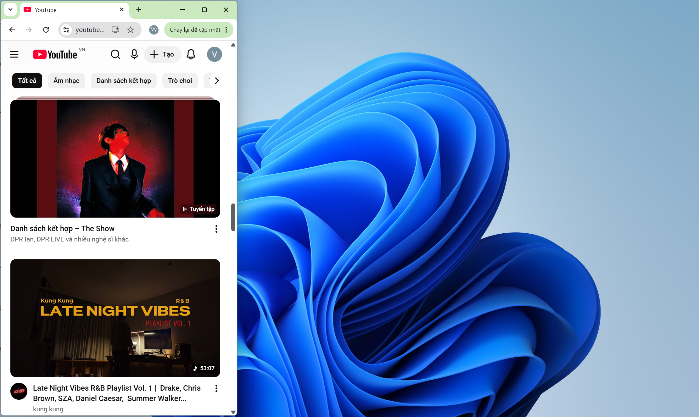
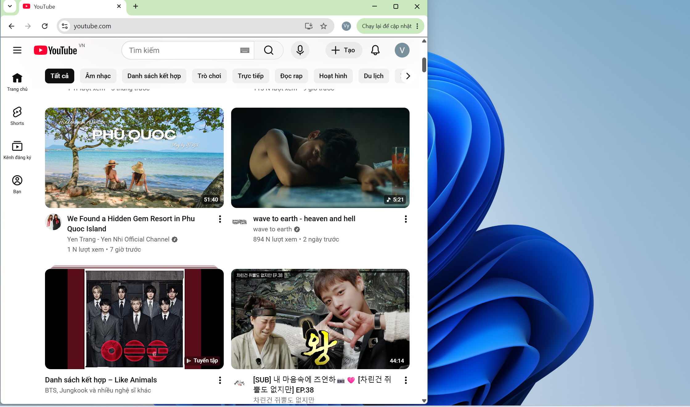
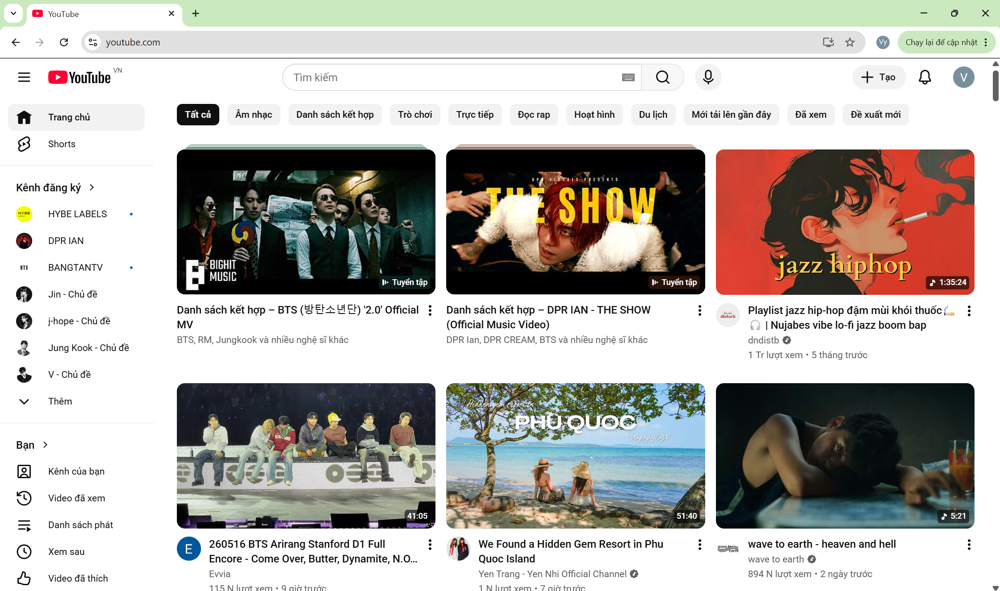
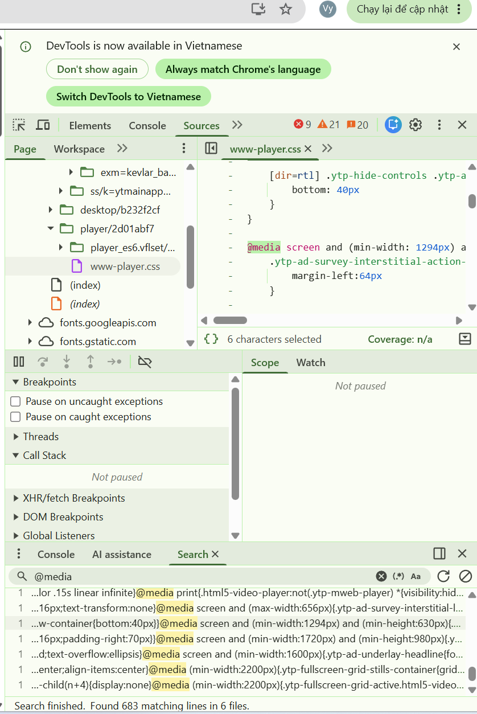
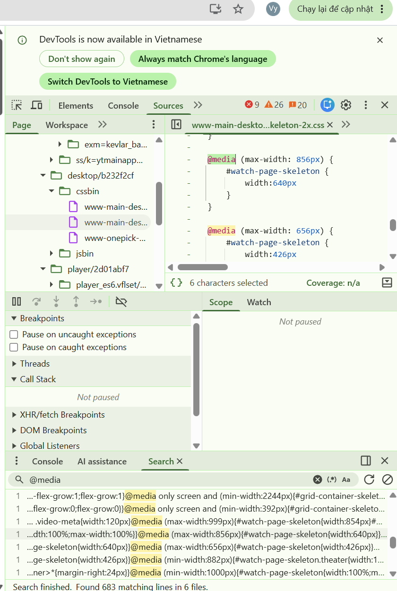

# 📋 PHIẾU BÀI TẬP 05

# **CSS RESPONSIVE & SCSS — Responsive Design, Media Queries, Sass**

> **Tài liệu tham chiếu:** `tuan_3_css_advanced/13_creating_responsive_layouts.md` → `16_sass_scss.md`

---

## PHẦN A — KIỂM TRA ĐỌC HIỂU (20 điểm)

### Câu A1 (5đ) — Viewport & Mobile-First

1. Thẻ <meta viewport> chuẩn:
   `<meta name="viewport" content="width=device-width, initial-scale=1.0">`

- width=device-width: Báo cho trình duyệt biết hãy thiết lập chiều rộng của trang web bằng đúng với chiều rộng vật lý thực tế của màn hình thiết bị.
- initial-scale=1.0: Đặt mức độ thu phóng ban đầu là 100% khi trang vừa mới được tải xong, ngăn trình duyệt tự động zoom.

2. Nếu THIẾU thẻ này, iPhone sẽ hiển thị trang web:\
   -Nếu không có thẻ viewport, trình duyệt trên iPhone (và các thiết bị di động khác) sẽ tự động giả định trang web có chiều rộng khoảng 980px (tương đương với màn hình desktop thông thường). Sau đó, trình duyệt sẽ tự động thu nhỏ (scale) toàn bộ trang web lại để có thể nhét vừa vào màn hình điện thoại. Hậu quả là chữ trên trang sẽ trở nên bé xíu không thể đọc được, các nút bấm chồng chéo lên nhau và trải nghiệm người dùng (UX) cực kỳ tệ.

3. Mobile-First và Desktop-First khác nhau:
   - Mobile-First: Viết mã CSS mặc định dành cho màn hình nhỏ trước, sau đó sử dụng thẻ @media với điều kiện min-width (từ kích thước này trở lên) để bổ sung thiết kế cho các màn hình lớn hơn. Cách này viết CSS theo hướng mở rộng dần (progressive enhancement).
   - Desktop-First: Viết CSS mặc định cho màn hình lớn trước, sau đó dùng điều kiện max-width (từ kích thước này trở xuống) để điều chỉnh, thu hẹp giao diện cho vừa với các màn hình nhỏ.

   Ví dụ CSS:

   ```
   /_ --- TƯ DUY MOBILE-FIRST --- _/
   .container {
   width: 100%; /_ Mặc định cho mobile (dưới 768px) _/
   }
   @media (min-width: 768px) {
   .container {
   width: 750px; /_ Áp dụng từ giao diện tablet trở lên _/
   }
   }
   ```

```
/_ --- TƯ DUY DESKTOP-FIRST --- _/
.container {
width: 1200px; /_ Mặc định cho màn hình lớn _/
}
@media (max-width: 768px) {
.container {
width: 100%; /_ Áp dụng khi màn hình nhỏ từ mức tablet trở xuống _/
}
}
```

- Mobile-First được khuyên dùng vì:

* Tối ưu tốc độ tải (Performance): Các thiết bị di động (vốn có phần cứng và mạng yếu hơn) sẽ nhận ít CSS nhất, giúp trình duyệt phân tích (parse) nhanh hơn mà không phải tải thêm phần style phức tạp của desktop.
* Tư duy nội dung (Content thinking): Buộc lập trình viên phải ưu tiên chắt lọc các nội dung quan trọng nhất hiển thị trong không gian chật hẹp trước khi mở rộng ra.
* Tốt cho SEO: Google đã áp dụng chính sách "Mobile-First Indexing" (ưu tiên thu thập dữ liệu bản mobile trước), do đó phương pháp này sẽ được Google và các công cụ đo hiệu năng đánh giá thứ hạng cao hơn.

### Câu A2 (5đ) — Breakpoints

1. Mobile\
   Kích thước pixel: < 576px.\
   Thiết bị đại diện: iPhone SE, các điện thoại nhỏ.\
   Ví dụ lưới sản phẩm: Nên hiển thị 1 cột (để đảm bảo hình ảnh và chữ đủ lớn, dễ chạm).

2. Mobile L (Mobile Large)\
   Kích thước pixel: ≥ 576px.\
   Thiết bị đại diện: iPhone Plus, điện thoại khi xoay ngang.\
   VD lưới sản phẩm: Nên hiển thị 2 cột.

3. Tablet\
   Kích thước pixel: ≥ 768px.\
   Thiết bị đại diện: iPad cầm dọc, các loại tablet tiêu chuẩn.\
   Ví dụ lưới sản phẩm: Nên hiển thị 2 đến 3 cột tùy thuộc vào độ phức tạp của thẻ sản phẩm.

4. Desktop\
   Kích thước pixel: ≥ 992px.\
   Thiết bị đại diện: Laptop nhỏ.\
   VD lưới sản phẩm: Nên hiển thị 3 đến 4 cột.

5. Desktop L (Desktop Large)\
   Kích thước pixel: ≥ 1200px.\
   Thiết bị đại diện: Desktop, laptop lớn.\
   Ví dụ lưới sản phẩm: Nên hiển thị 4 đến 5 cột.

6. Desktop XL (Desktop Extra Large)\
   Kích thước pixel: ≥ 1400px.\
   Thiết bị đại diện: Màn hình 4K, màn hình siêu rộng (ultrawide).\
   Ví dụ lưới sản phẩm: Nên giới hạn hiển thị 5 đến 6 cột hoặc giữ nguyên số cột như Desktop L nhưng tăng kích thước của khoảng trống (margin/padding) để giao diện không bị quá loãng.

### Câu A3 (5đ) — Media Queries

| Chiều rộng màn hình | `.container` width |
| ------------------- | ------------------ |
| 375px (iPhone SE)   | 100%               |
| 600px               | 540px              |
| 800px               | 720px              |
| 1000px              | 960px              |
| 1400px              | 1140px             |

### Câu A4 (5đ) — SCSS Basics

4 tính năng chính của SCSS:

1. Variables (Biến): SCSS cho phép bạn lưu trữ các giá trị thiết kế (design tokens) để dùng chung ở nhiều nơi thông qua dấu $. Đặc điểm của SCSS variables là chúng hoạt động ở lúc biên dịch (compile-time) và bạn có thể sử dụng các hàm SCSS đi kèm (như darken, lighten) để tính toán màu sắc.

- VD SCSS:

```
$primary-color: blue;
$text-color: white;

.button {
    background-color: $primary-color;
    color: $text-color;
}
```

2. Nesting (Viết CSS lồng nhau): Thay vì viết các selector rời rạc, SCSS cho phép lồng các thẻ CSS vào nhau theo đúng cấu trúc của HTML. Ký tự & được sử dụng để đại diện cho phần tử cha (parent selector). Tuy nhiên, quy tắc quan trọng nhất là không được lồng quá 3 cấp, vì lồng quá sâu sẽ tạo ra các selector cồng kềnh, khó ghi đè (override) và làm giảm hiệu suất (performance).

-VD:

```
.navbar {
    background: black;

    ul {
        list-style: none;
    }

    li {
        display: inline-block;
    }

    a {
        color: white;
    }
}
```

3. Mixins (@mixin, @include): Được ví như "hàm CSS tái sử dụng". Rất hữu ích cho các đoạn code lặp lại nhiều lần như button styles hoặc định nghĩa media queries. Từ khóa @mixin dùng để định nghĩa (khai báo hàm), còn @include dùng để gọi (sử dụng hàm đó).

- VD:

```
@mixin flex-center {
    display: flex;
    justify-content: center;
    align-items: center;
}

.box {
    @include flex-center;
    height: 100px;
}
```

4. @extend / Inheritance: Tính năng này cho phép một selector "kế thừa" toàn bộ các thuộc tính CSS từ một selector khác, giúp mã nguồn DRY (Don't Repeat Yourself).

- VD:

```
.button {
    padding: 10px;
    border-radius: 5px;
}

.primary-button {
    @extend .button;
    background: blue;
}
```

- Trình duyệt không có khả năng đọc hiểu SCSS trực tiếp vì nó chỉ được thiết kế để hiểu ngôn ngữ CSS tiêu chuẩn nguyên bản. SCSS thực chất là "CSS nâng cao" (Sass preprocessor) với các cú pháp bổ sung dành riêng cho lập trình viên.

- Cần bước gì để chuyển SCSS → CSS? Để trình duyệt đọc được, SCSS bắt buộc phải trải qua bước biên dịch (compile) thành CSS thông thường. Quá trình compile này xảy ra ở giai đoạn build-time (lúc xây dựng code) chứ không phải lúc người dùng tải trang, nên nó không hề làm chậm tốc độ của website.

  Về cách thực hiện, bạn có thể sử dụng các extension như "Live Sass Compiler" trong VS Code (chỉ cần ấn nút "Watch Sass" để tự động xuất ra file CSS), hoặc dùng qua các công cụ lớn hơn như Webpack, Vite, node-sass.

---

## PHẦN B — THỰC HÀNH CODE (60 điểm)

### Bài B1 (25đ) — Responsive Product Page

### Bài B2 (15đ) — CSS Transitions & Animations

### Bài B3 (20đ) — SCSS Refactor

# SCSS Compile Command

Compile SCSS → CSS:

```
sass scss/style.scss style.css
```

Watch mode:

```
sass --watch scss/style.scss:style.css
```

## PHẦN C — PHÂN TÍCH (20 điểm)

### Câu C1 (10đ) — Phân tích trang web thực

Youtube

1. Mobile (375px)
   

Phân tích

Navigation thay đổi thế nào?

Có hamburger menu (☰).
Thanh tìm kiếm bị rút gọn thành icon 🔍.
Sidebar đầy đủ bị ẩn.

Lưới content mấy cột?
→ 1 cột

Elements bị ẩn trên mobile?

Sidebar bên trái đầy đủ.
Một số text menu.
Thanh navigation mở rộng.

Font size thay đổi không?
→ Có, nhỏ hơn desktop để vừa màn hình.

2. Tablet (768px)
   

Phân tích

Navigation thay đổi thế nào?

Search bar dài hơn.
Sidebar mini xuất hiện (icon only).

Lưới content mấy cột?
→ 2–3 cột video (tuỳ chiều rộng thực).

Elements bị ẩn?

Sidebar text đầy đủ vẫn chưa hiện hoàn toàn.

Font size thay đổi không?
→ Có tăng nhẹ so với mobile.

3. Desktop (1440px)
   

Phân tích

Navigation thay đổi thế nào?

Search bar đầy đủ.
Sidebar mở rộng có text.
Nhiều icon hơn (Create, Notifications…).

Lưới content mấy cột?
→ khoảng 4–5 cột

Elements bị ẩn trên desktop?
→ Hầu như không.

Font size thay đổi không?
→ Có, title và menu dễ đọc hơn.




### Câu C2 (10đ) — Thiết kế Responsive Strategy

1. Wireframe — Mobile (<768px)

Chiến lược mobile-first: ưu tiên đặt bàn nhanh, ít rối.

┌─────────────────────┐\
│ HEADER │\
│ Logo ☎ Hotline │\
├─────────────────────┤\
│ HERO IMAGE │\
│ (full width) │\
├─────────────────────┤\
│ FORM ĐẶT BÀN │\
│ Ngày │\
│ Giờ │\
│ Số người │\
│ Ghi chú │\
│ [Đặt bàn] │\
├─────────────────────┤\
│ FOOD GRID (1 cột)
│ [Ảnh món] │\
│ [Ảnh món] │\
│ ... │\
├─────────────────────┤\
│ GOOGLE MAPS │\
├─────────────────────┤\
│ FOOTER │\
└─────────────────────┘\
Mobile: Ẩn gì? Form ở đâu?

Ẩn / giảm bớt:

Không hiện menu phức tạp.
Không sidebar.
Có thể giảm chiều cao hero image để nhẹ hơn.

Form đặt bàn nằm:
→ ngay dưới Hero image để user đặt bàn nhanh nhất trên điện thoại.

2. Wireframe — Tablet (768px–1023px)
   ┌────────────────────────────┐\
   │ HEADER │\
   │ Logo ☎ Hotline │\
   ├────────────────────────────┤\
   │ HERO IMAGE │\
   ├────────────────────────────┤\
   │ FORM ĐẶT BÀN │\
   ├────────────────────────────┤\
   │ FOOD GRID (2 cột) │\
   │ [img] [img] │\
   │ [img] [img] │\
   │ [img] [img] │\
   ├────────────────────────────┤\
   │ GOOGLE MAPS │\
   ├────────────────────────────┤\
   │ FOOTER │\
   └────────────────────────────┘\
   Tablet

Grid ảnh mấy cột?
→ 2 cột

Bản đồ nằm đâu?
→ dưới gallery món ăn, full width.

3. Wireframe — Desktop (≥1024px)
   ┌──────────────────────────────────────────────┐\
   │ HEADER │\
   │ Logo Hotline + Nav │\
   ├──────────────────────────────────────────────┤\
   │ HERO IMAGE │\
   ├──────────────────┬───────────────────────────┤
   │ FOOD GRID │ FORM ĐẶT BÀN │\
   │ (3 cột ảnh) │ Ngày │\
   │ [ ] [ ] [ ] │ Giờ │\
   │ [ ] [ ] [ ] │ Số người │\
   │ │ Ghi chú │\
   │ │ [Đặt bàn] │\
   ├──────────────────┴───────────────────────────┤\
   │ GOOGLE MAPS │\
   ├──────────────────────────────────────────────┤\
   │ FOOTER │\
   └──────────────────────────────────────────────┘\
   Desktop

Layout mấy cột?
→ 2 cột chính

trái: food gallery
phải: booking form

Sidebar có không?
→ Không cần sidebar riêng vì nội dung không nhiều. Form đặt bàn đóng vai trò như sidebar bên phải.

4.

```
 CSS Skeleton (Mobile-First)
   /_ =========================
   MOBILE FIRST
   ========================= _/

* {
  margin: 0;
  padding: 0;
  box-sizing: border-box;
  }

body {
font-family: Arial, sans-serif;
}

.container {
display: grid;
gap: 16px;
padding: 16px;
}

/_ Header _/
.header {
display: flex;
justify-content: space-between;
align-items: center;
}

/_ Hero _/
.hero {
height: 250px;
background: lightgray;
}

/_ Form _/
.booking-form {
display: grid;
gap: 10px;
}

/_ Food Grid _/
.food-grid {
display: grid;
grid-template-columns: 1fr;
gap: 12px;
}

.food-item {
height: 180px;
background: #ddd;
}

/_ Google Maps _/
.map {
height: 300px;
background: #ccc;
}

/_ Footer _/
.footer {
text-align: center;
padding: 20px;
}

/_ =========================
TABLET (768px+)
========================= _/

@media (min-width: 768px) {

    .food-grid {
        grid-template-columns: repeat(2, 1fr);
    }

    .hero {
        height: 350px;
    }

}

/_ =========================
DESKTOP (1024px+)
========================= _/

@media (min-width: 1024px) {

    .content-layout {
        display: grid;
        grid-template-columns: 2fr 1fr;
        gap: 20px;
        align-items: start;
    }

    .food-grid {
        grid-template-columns: repeat(3, 1fr);
    }

    .hero {
        height: 450px;
    }

}
```

Giải thích chiến lược responsive\
Mobile: 1 cột, ưu tiên đặt bàn nhanh, form đặt ngay đầu.\
Tablet: gallery 2 cột để tận dụng không gian.\
Desktop: chia 2 cột lớn, food gallery + form cạnh nhau để nhìn chuyên nghiệp hơn.

---

## 🎬 PHẦN D — VIDEO THỰC HÀNH OBS (25 điểm)

https://drive.google.com/file/d/1Jl0-ttENwWXiulTpf9RnNyKeFXtRLwYD/view?usp=drive_link
